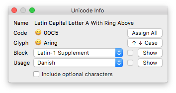

# RFUnicodeInfo

Unicode Info displays information about the current glyph:

* Unicode name
* Unicode codepoint (incl. validation)
* AGLFN or GNFUL glyph name (incl. validation)
* Unicode block
* Orthographic usage

A smiling face means that your glyph name and Unicode value are matching. An angry face means things are not like they should be.

Unicode Info also offers useful actions:

* Reassign all Unicode values in the current font based on glyph names
* Switch to the corresponding uppercase or lowercase version of the current glyph
* Show the contents of the selected Unicode block (as template glyphs directly in the font window)
* Show all characters needed to support the selected orthography (as template glyphs directly in the font window)

Bring up the Unicode Info window using the shortcut ctrl-cmd-U.
